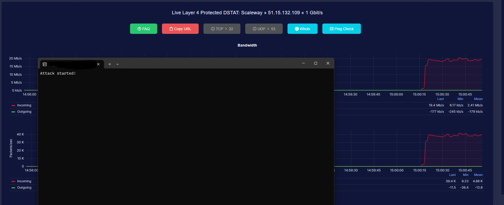

# SILENCE METHOD

This script is a UDP flood attack script designed for educational purposes only. It is important to note that using this script for any malicious activities is strictly prohibited and can result in legal consequences. The author of this script, TryWarz, does not take any responsibility for any damage caused by the misuse of this script. Use it at your own risk.

## Usage

To use this script, follow the steps below:

1. Make sure you have Python installed on your system.
2. Open the script in a code editor.
3. Modify the `IP` and `PORT` variables to specify the target server's IP address and port number.
4. Run the script.

## Power

```py
# if you have 1 botnet = 20 - 100 mb/s
# if you have 20k botnet = +400 Gbps/s
# if you have 50k botnet = +1 Tbps/s
```

## Disclaimer

This script is intended for educational purposes only. It demonstrates the concept of a UDP flood attack and should not be used for any malicious activities. Using this script without proper authorization is illegal and unethical. The author and the GitHub repository (https://github.com/TryWarz) are not responsible for any misuse of this script.

## Warning

Performing a UDP flood attack can cause significant harm to the target server and is considered a cybercrime. It is important to understand the legal implications and ethical considerations before attempting any form of attack. Always obtain proper authorization and use this script responsibly.

## Note

The script utilizes the `socket` and `threading` modules in Python to send multiple GET requests to the target server. It is important to note that this script can be easily modified to include backdoors or remote access tools (RATs). Such modifications are highly discouraged and can lead to severe consequences.

## Dismantling


## Contact

For any questions or concerns regarding this script, please contact the author, TryWarz, through the GitHub repository mentioned above.
